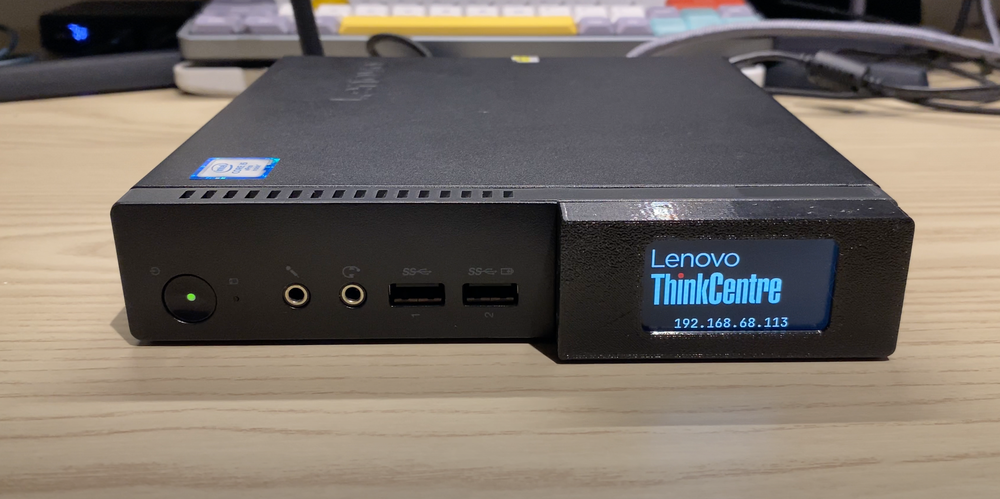
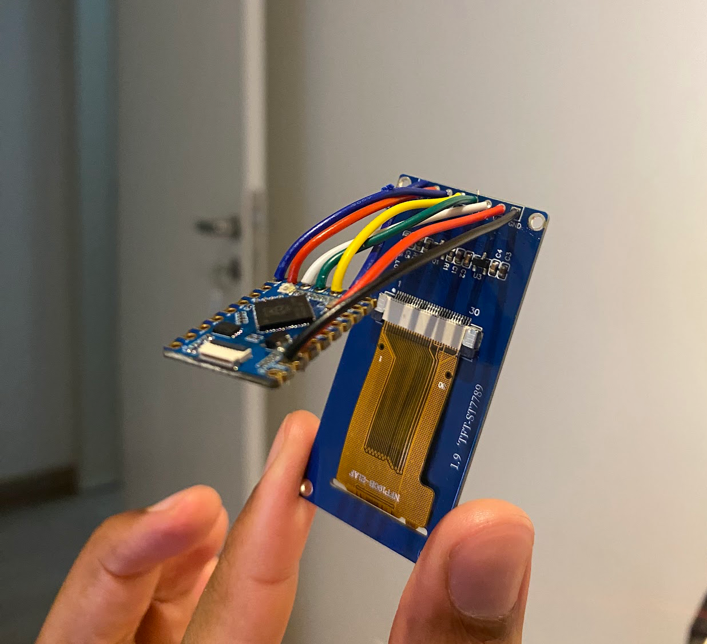
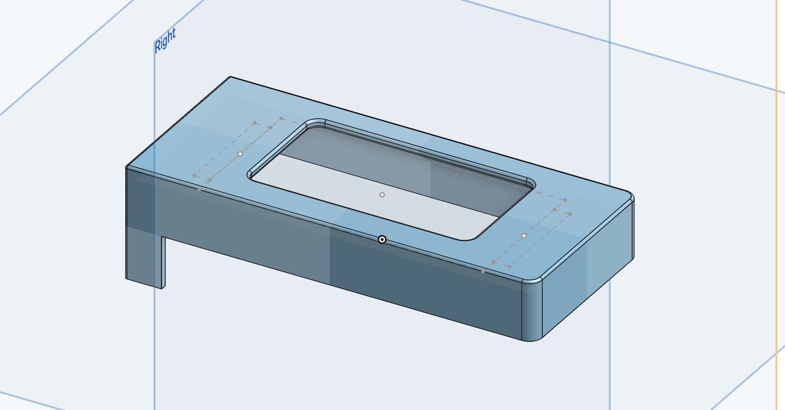
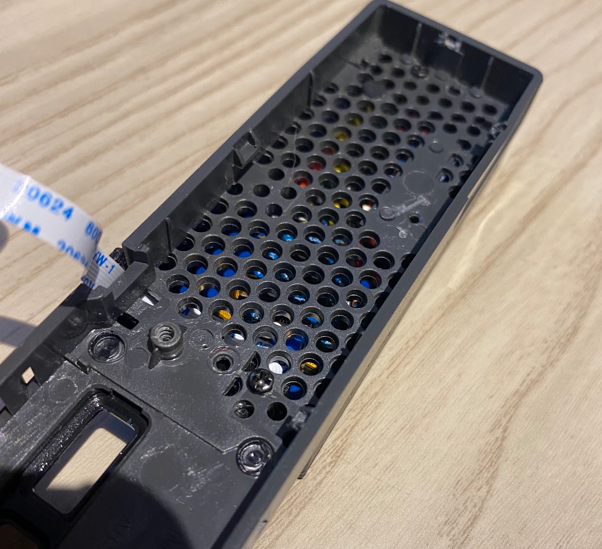

# uptimedisplay

A small display that attaches to your ThinkCentre M910q Tiny case, providing real-time system information on a compact display. Adapting this to any other linux system should be straightforward, you just need to redesign the case.



YouTube video: [https://www.youtube.com/watch?v=xrLVMV-9TQI](https://www.youtube.com/watch?v=xrLVMV-9TQI)

## Project Overview

uptimeDisplay is built using go and tinygo, and is designed to run on the RP2040 Zero from Waveshare. It connects to a 1.9" LCD display with an ST7789 driver, the communication between the display and the server is done via serial over usb. To control the display you can use the provided daemon or write your own. Here is the sample configuration file for the daemon:

```json
{
    "device_path": "/dev/ttyACM0",
    "baud_rate": 115200,
    "update_interval": 3,
    "props": [
        {
            "name": "Uptime",
            "command": "uptime -p | sed 's/up //; s/,//g'"
        },
        {
            "name": "Kernel Version",
            "command": "uname -r"
        },
        {
            "name": "Logged Users",
            "command": "who | wc -l"
        },
        {
            "name": "Processes",
            "command": "ps -e | wc -l"
        },
        {
            "name": "CPU Model",
            "command": "cat /proc/cpuinfo | grep 'model name' | head -n 1 | cut -d ':' -f2 | xargs"
        },
        {
            "name": "CPU Temperature",
            "command": "cat /sys/class/thermal/thermal_zone0/temp | awk '{print $1/1000}' | sed 's/$/°C/'"
        }
    ]
}
```
You can set the prop name and command to anything you want and it should be displayed on the screen.


## Hardware Requirements

- Raspberry Pi Pico or RP2040 Zero (Waveshare)
- 1.9" ST7789 LCD Display with SPI interface
- USB-C cable for connecting the RP2040 to the server
- Mounting hardware/case (optional)

## Software Requirements

- [TinyGo](https://tinygo.org/) (latest version recommended)
- Go 1.23.4 or later
- Linux with `systemd` for daemon setup
  
## Installation

### Setting up TinyGo

1. Install TinyGo following the [official guide](https://tinygo.org/getting-started/install/).

2. Clone the UpTimeDisplay repository:
   ```bash
   git clone https://github.com/danfragoso/uptimedisplay.git
   cd uptimedisplay
   ```

### Building and Flashing

1. Connect your RP2040 to your computer in bootloader mode (hold BOOTSEL button while plugging in USB)

2. Go into the firmware directory:
   ```bash
   cd firmware
   ```

3. Build and flash the firmware:
   ```bash
   tinygo flash -target=waveshare-rp2040-zero -monitor    
   ```

4. Test the display:
   ```bash
   screen /dev/ttyACM0 115200
   type `test|test` and press enter
   ```

### Hardware Setup

1. Connect the display to the RP2040 using the following pin connections:
   - LCD_DC → GP8
   - LCD_CS → GP9
   - LCD_CLK → GP10
   - LCD_DIN → GP11
   - LCD_RST → GP12
   - LCD_BL → GP13
   - LCD_VCC → 3.3V
   - LCD_GND → GND



2. Optional, print the case design and mount the display on your ThinkCentre M910q Tiny case using 3 1.8mm screws. 

    The case design is available on Onshape:
   https://cad.onshape.com/documents/b809d4dbc1da09ae5af0a4d1/w/9f13a965aa19a6f4a93f9ab8/e/c59b680da1d3aa7db4bb427f

   

2.1. Fit the display into the case, remove the red lenovo accent piece, snake the cable through the hole and mount the display.

   


## Usage

1. After connecting the display, it will automatically initialize and display the splash.

2. The server needs to run a companion service that collects system metrics and sends them to the display device via serial communication.

3. You can build the provided daemon, copy it to your server and enable it with systemd:
   ```bash
   cd daemon
   go build -o uptimedisplay main.go
   sudo cp uptimedisplay /usr/local/bin/
   sudo cp daemon/uptimedisplay.service /etc/systemd/system/
   sudo systemctl enable uptimedisplay.service
   sudo systemctl start uptimedisplay.service
   ```

## Configuration

Configuration is done by modifying the config.json file, you need to copy it to /var/uptimedisplay/config.json and set the correct permissions:
```bash
sudo mkdir -p /var/uptimedisplay
sudo cp config.json /var/uptimedisplay/config.json
```

## How It Works

1. The RP2040 initializes the ST7789 display via SPI communication
2. A companion daemon on the server collects system metrics
3. Data is sent to the RP2040 via serial communication over USB
4. The display parses the data and renders it using the TinyFont library
5. The display refreshes at configured intervals

## Development

This project uses several TinyGo libraries:
- [`tinygo.org/x/drivers/st7789`](https://pkg.go.dev/tinygo.org/x/drivers/st7789) for display control
- [`tinygo.org/x/tinyfont`](https://pkg.go.dev/tinygo.org/x/tinyfont) for text rendering
- Various font packages from the TinyFont library


## Acknowledgments

- TinyGo community for the excellent embedded Go support
- Waveshare for the RP2040 Zero hardware

